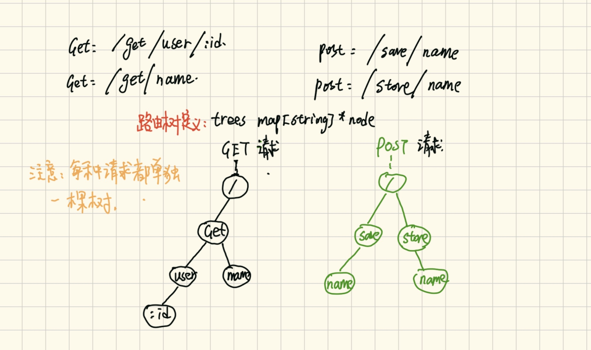

## Server和Route的设计
使用`go`语言实现一个简单的`web`服务，可使用如下代码实现，使用`curl 'http://localhost:8080'`请求，返回`Hello World`。`Server`从特性上来说，至少要具有如下功能：
1、生命周期控制：启动、关闭，以及考虑增加生命周期回调特性，2、路由注册接口：提供路由注册功能。
```go
package main

import (
	"fmt"
	"net/http"
)

func main() {
	http.HandleFunc("/", func(w http.ResponseWriter, r *http.Request) {
		fmt.Fprintf(w, "Hello World")
	})
	// http/server.go中 ListenAndServe方法是引入自定义web框架的连接点.
	// func ListenAndServe(addr string, handler Handler) error 
	http.ListenAndServe(":8080", nil)
} 
```
显然使用原生`net/http`包并不满足要求，可以定义`Server`接口以及其实现`HTTPServer`，`HTTPServer`实现了`Start`方法及组合`http.Handler`的`ServeHTTP`方法。因而，在`Start`方法最后一行，`HTTPServer`可以作为回调对象。
```go
type Server interface {
    http.Handler
    Start(add string) error
    // AddRoute 路由注册, method是http方法、path是路由、handleFunc是业务逻辑
    AddRoute(method string, path string, handleFunc HandleFunc)
}

// 确保HttpServer肯定实现了Server接口
var _ Server = &HTTPServer{}
type HTTPServer struct {
}
// ServeHTTP HTTPServer 处理请求入口
func (h *HTTPServer) ServeHTTP(writer http.ResponseWriter, request *http.Request) { 
	// TODO: 整个web框架的核心入口，在此将完成 Context构建、路由匹配、执行业务逻辑
}
func (h *HTTPServer) Start(addr string) error {
    listener, err := net.Listen("tcp", addr)
    if err != nil {
        return err
    }
    // 与直接调用http.ListenAndServe(":8081", h)相比，使用HTTPServer可以注册callback function
    return http.Serve(listener, h)
}
func (h *HTTPServer) AddRoute(method string, path string, handleFunc HandleFunc) {
	// TODO: implement me
}
```
参考`gin`、`echo`的路由设计，路由树归根结底就是一棵多叉树（`gin`中每种`http`方法一棵树，例如`GET`、`POST`请求分别一棵树）,节点维持主自己的子节点。`route`核心设计如下：
<p>
    
</p>

```go
// router 用来支持对路由树的操作
type router struct {
	// Beego Gin HTTP method也对应一棵树，例如GET => *node
	trees map[string]*node
}

type node struct {
    route string
    path string
    // 子path到子节点的映射
    children map[string]*node
    // 用户注册的业务逻辑
    handler HandleFunc
}

// 添加路由及根据method和path查找路由信息
func (r *router) addRoute(method string, path string, handleFunc HandleFunc) {
    // TODO: implement me
}
func (r *router) findRoute(method string, path string) (*matchInfo, bool) {
    // TODO: implement me
}
```
路由具体实现请看`web/router.go`源码，注意事项：1、已经注册的路由，无法被覆盖，例如/user/home注册两次，会冲突。 2、path必须以/开始并且结尾不能有/；3、不能在同一个位置注册不同的参数路由，例如/user/:id和/user/:name冲突。最后可以考虑在注册路由的时候强制`panic`，修复了路由冲突后，再启动服务。


